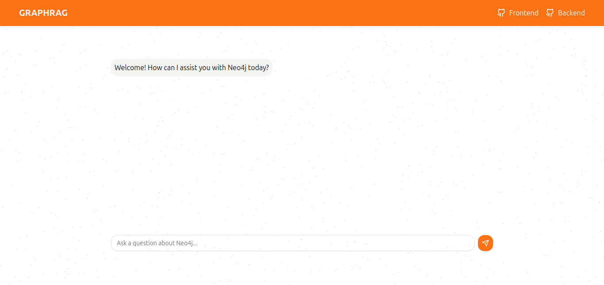

# GraphRAG Frontend Application

## Introduction

This is a React-based frontend application built with Vite to provide an interactive interface for querying a Neo4j knowledge graph. The application supports user queries, integrates GraphQL for API calls, and streams real-time responses from Neo4j. It leverages Tailwind CSS for styling and ReactMarkdown for rendering markdown content.

## Features

- Query a Neo4j database using GraphQL.
- Real-time response streaming.
- Interactive and user-friendly chat interface.
- Responsive design using Tailwind CSS.

## Example UI

Below is an example of the application's chat interface:



## Installation

Follow the steps below to set up and run the application locally:

### Prerequisites

- Node.js (v22 or later)
- npm or yarn

### Steps

1. **Clone the repository:**

   ```bash
   git clone https://github.com/fabischkamau/moduskgfrontend.git
   cd moduskgfrontend
   ```

2. **Install dependencies:**

   ```bash
   npm install
   # Or, if using yarn:
   yarn install
   ```

3. **Set environment variables:**
   Create a `.env` file in the root directory with the following keys:

   ```env
   VITE_MODUS_API_ENDPOINT=<your-api-endpoint>
   VITE_MODUS_API_TOKEN=<your-api-token>
   ```

4. **Run the development server:**

   ```bash
   npm run dev
   # Or, if using yarn:
   yarn dev
   ```

5. **Access the application:**
   Open your browser and navigate to `http://localhost:5173`.

## Usage

1. Start the application using the steps above.
2. Use the input box to ask questions related to the Neo4j knowledge graph.
3. View the responses in the chat interface.

## Deployment

To deploy the application:

1. Build the project:

   ```bash
   npm run build
   # Or, if using yarn:
   yarn build
   ```

2. Serve the build folder using any static file server or deploy it to platforms like Vercel, Netlify, or AWS S3.

## Contributing

Contributions are welcome! Feel free to open an issue or submit a pull request.

## License

This project is licensed under the MIT License. See the LICENSE file for more details.

---

Feel free to reach out if you have questions or need support.
